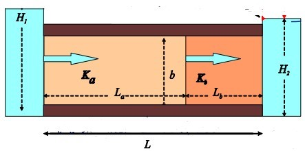

# Challenge #2

#### Dalia Portillo

### 1. Show based on flux with horizontal distance to constant head boundaries that the model is steady state. Calculcate flux at each point. Heads at center of each cell and K defined over each cell.


*Figure 1 Steady State Homogeneous Model*


*Figure 2 Flux in and out each node/cell*

In Figure 2 we see a constant flux in and out of each cell. With the exception of some outliers, q is constant with distance from the constant head boundaries. These outliers (or wiggliness in behavior) are mainly due to the limits of the solver; in Excel, we can change the number of iterations the solver can do so that the model can converge.

### 2. Show the steady state head contour in plan view for the heterogeneous (zones in series) condition. Use this plot to defend a contention that flow is 1D. Then, drawing on your Excel assignment, use the results to explain WHY the equivalent hydraulic conductivity, Keq, is closer to the lower of the two K values.



*Figure 3 The Heterogenous Model should look like this with layers in series*


*Figure 4 Steady State Heterogeneous Model*

Figure 4 displays the Head Contours as a result of manually changing the hydrauic conductivity values for the Box Model. We know that flow is always perpendicular to equipotential lines, or head contours. Knowing this, we should be able to draw a straightline across the graph. We won't see any changes in flow direction, thus we can assume flow is 1D horizontal.

Since the model is a box made up of 25x25 cells, I will assume the thickness b = 1, we should be able to solve for a Keq:


```python
la=3
lb=18
lc=4
L = la+lb+lc
k1=3 #m/d
k2=1 #m/d
k3=0.5 #m/d

Keq= L/((la/k1)+(lb/k2)+(lc/k3)) #m/d
print(str(Keq) +" m/d")
```

    0.9259259259259259 m/d
    

$ K =\large \frac{L}{\frac{la}{k1}+\frac{lb}{k2}+\frac{lc}{k3}} = \frac{25}{\frac{3}{3}+\frac{18}{1}+\frac{4}{0.5}}$

$ K = 0.925 m/d$


Again, the Keq is closer to the lower K (K3=0.5 m/d) because the head gradient gets steeper and the energy required to move through the new K is 'dissipated'. A lower K can indicate a lower porosity and smaller area for which water/fluids can flow through. Smaller area requires a higher velocity of flow to move through it if the mass flux is to remain constant. The Keq is a weighted average of the spaitiall distributed K values, and energy dissipated is related to the square of the gradients at each cell.

### 3. Build a model based on a homogeneous domain with a square region of lower K in the middle of the domain. What can you learn based on your explanation of what controls the effective K for a 1D flow system now that you are applying it to a 2D system? What do you think the Keq of this entire system would be compared to the high and low K values? Explain why it is much more difficult to develop a direct solution for this 2D system than it was for a 1D system (including the zones placed in series)


*Figure 5 Heterogenous Model with inclusive low K values of 0.5 m/d within rows 11-15 and columns 11-15*


The effective K can be applied to both the x and y directions - making it 2D. If flow is moving left to right, columns 23-25 won't respond the same as columns 1-4. This is because each cell responds to its neighboring cells. If the medium contains the same K value but has a small section in the center with a low K, then the energy required to flow through the entire medium will be directed towards this center section of low K. A Keq won't compltely represent the system now that a small part of the medium requires all the energy to push through. If the inclusive area is small enough, the Keq might neglect this low K region. If the inclusive area is large enough, then the medium may just be three layers in series and Keq will likely be equal to this inclusive layer in the center which doesn't necessarily represent the entire medium.
Additonally, K needs to calculated in two directions: Kx and Ky for this 2D system. This does not mean flow is in two directions! Flow will always be parallel to no flow boundaries but can move in any direction between each cell. q is calculated at each node.
